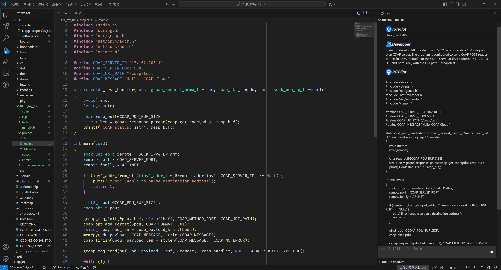

# IoTPilot

## Get Started

### Installation
This is a VS Code extension. You can follow the [official instructions](https://code.visualstudio.com/api/get-started/your-first-extension) and [vsc extension quickstart](vscode_extension/vsc-extension-quickstart.md) to run the extension locally in debugging mode.

### Usage

You can enter your IoT development requirements in the dialog box, and IoTPilot will generate code that meets your requirements as much as possible.
With the generated code, you can quickly start your IoT programming tasks. Although IoTPilot may not be completely accurate, it is designed to help users develop IoT applications faster. You can interact with IoTPilot in multiple iterations to improve the quality of the generated code, making it eventually usable.

### Coming soon
The VS Code extension will soon be available on the marketplace.


## Example

User→Input `Give me a MQTT application, which need to update local device state (ready or not ready) to Cloud EMQX. It builds on RIOT OS and runs on ESP32. `

IoTPilot→Exec `python3 iotpilot.py --model="gpt-4o" --iscontext=True --isexecution=True --userproblem="I need to develop a RIOT-based MQTT program runing on ESP32. It needs to update local device state (ready or not ready) to Cloud EMQX Broker."` 

IoTPilot→Return

```c
#include <ztimer.h>
#include <timex.h>
#include <time_units.h>
#include <thread.h>
#include <paho_mqtt.h>
#include <arpa/inet.h>
#include <MQTTClient.h>

/* Function to update the local device state to Cloud EMQX Broker using MQTT */
int main(void) {
    Network network;
    MQTTClient client;
    unsigned int command_timeout_ms = 5000;
    uint8_t sendbuf[100], readbuf[100];

    // Initialize the network struct
    NetworkInit(&network);

    // Connect to the network (replace with actual address and port)
    char *address = "broker.emqx.io";
    int port = 1883;
    int rc = NetworkConnect(&network, address, port);

    if (rc != 0) {
        printf("Network connection failed\n");
        return -1;
    }

    // Initialize MQTT client with unsigned char buffers
    MQTTClientInit(&client, &network, command_timeout_ms,
                   (unsigned char*)sendbuf, sizeof(sendbuf),
                   (unsigned char*)readbuf, sizeof(readbuf));

    // Connect the MQTT client to the broker
    MQTTPacket_connectData connectData = MQTTPacket_connectData_initializer;
    connectData.MQTTVersion = 3;
    connectData.clientID.cstring = "esp32-client";

    rc = MQTTConnect(&client, &connectData);

    if (rc != 0) {
        printf("MQTT connection failed\n");
        return -1;
    }

    printf("MQTT connection successful\n");

    // Publish a message about the device state
    const char* topic = "device/state";
    MQTTMessage message;
    message.qos = 1;
    message.retained = 0;
    message.payload = "ready";  // or "not ready" based on the device state
    message.payloadlen = strlen((char*)message.payload);

    rc = MQTTPublish(&client, topic, &message);

    if (rc != 0) {
        printf("MQTT Publish failed\n");
        return -1;
    }

    printf("Device state published successfully\n");

    return 0;
}
```

user→Input `My MQTT broker address is "47.102.103.1”, port is “1883”`; user→point `line 36-37`

IoTPilot→Exec `python3 iotpilot.py --model="gpt-4o" --iscontext=True --isexecution=True --userproblem="The current code: {curr_code}. You need to modify the current code line 36-37 by {new prompt}"` 

IoTPilot→Return

```c
#include <ztimer.h>
#include <timex.h>
#include <time_units.h>
#include <thread.h>
#include <paho_mqtt.h>
#include <arpa/inet.h>
#include <MQTTClient.h>

/* Function to update the local device state to Cloud EMQX Broker using MQTT */
int main(void) {
    Network network;
    MQTTClient client;
    unsigned int command_timeout_ms = 5000;
    uint8_t sendbuf[100], readbuf[100];

    // Initialize the network struct
    NetworkInit(&network);

    // Connect to the network with the correct IP address
    char *address = "47.102.103.1";
    int port = 1883;
    int rc = NetworkConnect(&network, address, port);

    if (rc != 0) {
        printf("Network connection failed\n");
        return -1;
    }

    // Initialize MQTT client with unsigned char buffers
    MQTTClientInit(&client, &network, command_timeout_ms,
                   (unsigned char*)sendbuf, sizeof(sendbuf),
                   (unsigned char*)readbuf, sizeof(readbuf));

    // Connect the MQTT client to the broker
    MQTTPacket_connectData connectData = MQTTPacket_connectData_initializer;
    connectData.MQTTVersion = 3;
    connectData.clientID.cstring = "esp32-client";

    rc = MQTTConnect(&client, &connectData);

    if (rc != 0) {
        printf("MQTT connection failed\n");
        return -1;
    }

    printf("MQTT connection successful\n");

    // Publish a message about the device state
    const char* topic = "device/state";
    MQTTMessage message;
    message.qos = 1;
    message.retained = 0;
    message.payload = "ready";  // or "not ready" based on the device state
    message.payloadlen = strlen((char*)message.payload);

    rc = MQTTPublish(&client, topic, &message);

    if (rc != 0) {
        printf("MQTT Publish failed\n");
        return -1;
    }

    printf("Device state published successfully\n");

    return 0;
}
```
Repeat this process until you believe it has accomplished the initial task.