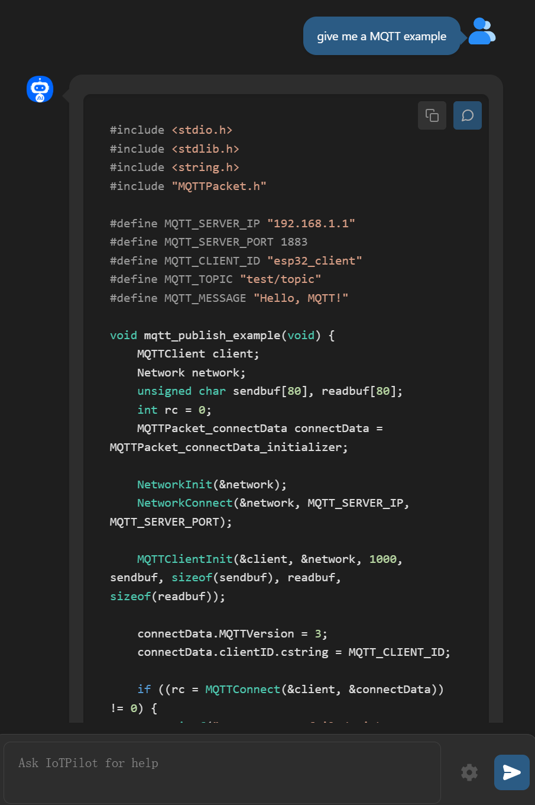

# Programming Embedded IoT Applications in Natural Language with IoTPilot

IoTPilot is an LLM-driven embedded IoT programming tool.
IoTPilot is conditionally accepted by ACM MobiSys'25.

* ./core: includes the code of IoTPilot prototype.
* ./benchmark: includes the benchmarks of RIOT, FreeRTOS, Zephyr and Contiki.
* ./datasets: includes the task description and RAG documents (extracted from OS repositories and API documentation).
* ./extension: includes the source code of IoTPilot VScode extension.
* ./test: includes scripts for calculating the success rate of API and header usage.

# Inroduction
We take a first step towards LLM-based embedded IoT application development and present IoTPilot, an LLM-driven embedded IoT programming tool. IoTPilot introduces two self-thinking chains to integrate internal LLM knowledge with external documentation, addressing conflicts in APIs and headers. 

## Preparation

We prepare the running environment with a Docker image. 
You can download the image file from [this link](https://drive.google.com/drive/folders/1llBLg2D8NM25jAn-zCmKUyigpMNsTqlK?usp=drive_link).

First, download IoTPilot docker image

```bash
docker load -i iotpilot.tar
```
Then, run IoTPilot docker to start the container.

```bash
docker run -it --name iotpilot iotpilot:0.1
```

After that, you can find the relevant code in the `/root/iotpilotv2` folder.

## Running Experiments

In the `./core` folder, you can start the experiment evaluation by running the command:

```bash
python3 start.py --api_key="xxx" --api_base="xxx"
```
The gpt-4o API key and base URL are needed. Then, it will test each RIOT task in sequence. Each task will undergo self-debugging for up to 15 iterations. If the program compiles successfully, the process will stop early.

The RIOT task is described in `./datasets/app.csv`.The generated code will be saved in the `./output` directory.The benchmarks for each prgram are in the `./benchmark` folder to evaluate the quality of IoTPilot's generated code.

After all RIOT applications have been generated (it might take some time), test the results the following command. For pass@rate, '1' indicates success, and '0' indicates failure. For acc@API and acc@Header, record the number of successful calls that match those in the reference correct code for APIs and Headers.

```bash
python3 test/passtest # pass@rate
python3 test/acctest_RIOT # acc@API, acc@Header
```

Currently, this image only integrates the RIOT compilation environment for verifying and testing the entire experimental process. [Zephyr](https://docs.zephyrproject.org/3.7.0/develop/getting_started/index.html), [Contiki](https://docs.contiki-ng.org/en/develop/doc/getting-started/Docker.html), and [FreeRTOS](https://docs.espressif.com/projects/esp-idf/en/latest/esp32/get-started/index.html#manual-installation) compilation environments need to be installed locally.
Then, generate code for different OSes, by

```bash
python3 start.py  --api_key="xxx" --api_base="xxx" --os_type="XXX"  # Possible values: 'RIOT', 'FreeRTOS', 'Zephyr', 'Contiki'
```


## VSCode Extension (Recommended)

We also provide a VSCode extension to enable users to use IoTPilot.
All source code for this extension is also available in the `./extension` directory.

If you want to deploy this extension yourself, you need to start the backend service by running the command and modify the IP address and port accordingly in the source code.

```bash
cd ./core & python gateway.py
```

### Installation
IoTPilot is available as a VS Code extension. You can install it directly from the VS Code extension marketplace by searching for "IoTPilot" . 

For development purposes, you can clone this repository and run the extension locally:
1. Clone the repository
2. Navigate to the extension directory
3. Run `npm install` to install dependencies
4. Press F5 in VS Code to launch the extension in debug mode

For more details, refer to the [official VS Code extension documentation](https://code.visualstudio.com/api/get-started/your-first-extension) or check our [extension quickstart guide](vscode_extension/vsc-extension-quickstart.md).

### Usage

Here are the configurable parameters for the IoTPilot plugin (see Figure 1):

* Username: It must be provided. It can be any input (currently no validation is required).
* API_KEY and API Base URL: It must be provided. By default, the deepseek-coder model is used.
* Model: Choose the backend LLM for IoTPilot, supporting GPT4o and deepseek-coder.
* OS Type: RIOT/FreeRTOS/Zephyr/Contiki. RIOT is fully supported, while the others are a work in progress.
* Device Type: Select the device on which the application will run.
* Max Attempts: The maximum number of self-debug attempts allowed. More iterations can improve the quality of the final code but will also take longer (We recommend setting this to 3).
* Use Context: This is a temporary parameter. If set to True, IoTPilot will introduce self-thinking chains; otherwise, it functions similarly to existing methods (such as MapCoder).

To use IoTPilot, follow these steps:
1. First, you can configure IoTPIlot parameters and save settings (see Figure 1).
2. Second, you can enter your IoT development requirements in the dialog box, and IoTPilot will generate code (see Figure 2). 
3. Third, after the server returns IoTPilot's generated results, there will be two buttons in the upper right corner of each response. These buttons allow you to conveniently copy the code to the clipboard or directly overwrite the current file content with that code (see Figure 3). 
4. Fourth, if most of the code is usable but contains minor errors, you can select the relevant code lines and continue the conversation with IoTPilot. This selected content will be included in the prompt to assist IoTPilot in subsequent generation (see Figure 3).
5. With the generated code, you can quickly start your IoT programming tasks. You can interact with IoTPilot in multiple iterations to enhance the quality of the generated code, making it eventually usable.
 
 <div style="display: flex; justify-content: center; align-items: flex-end; gap: 10px; flex-wrap: wrap;">
  <figure style="text-align: center; margin: 12px;">
    
    <figcaption>Figure 1: Settings Interface</figcaption>
  </figure>
  <figure style="text-align: center; margin: 12px;">
    
    <figcaption>Figure 2: Dialogue Interface</figcaption>
  </figure>
  <figure style="text-align: center; margin: 12px;">
    
    <figcaption>Figure 3: Select and Accept Interface</figcaption>
  </figure>
</div>


