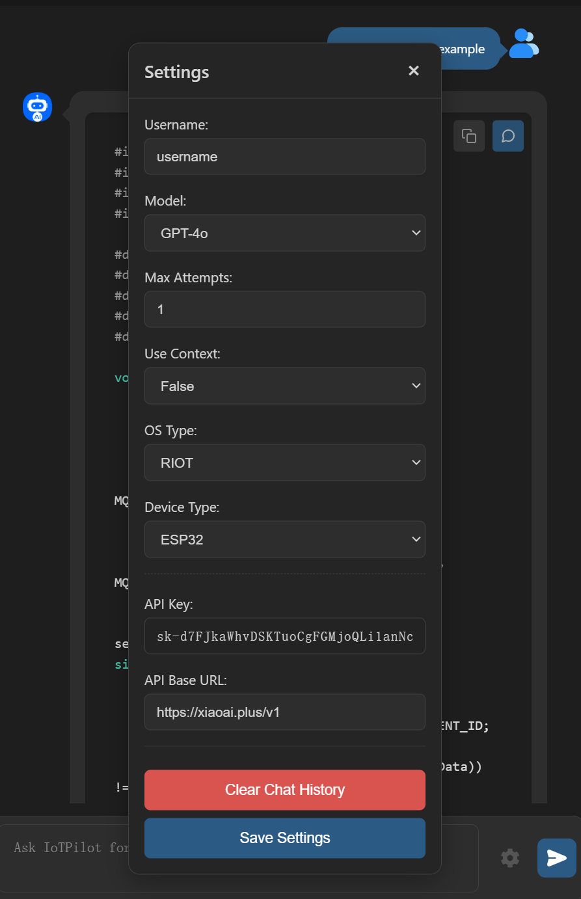
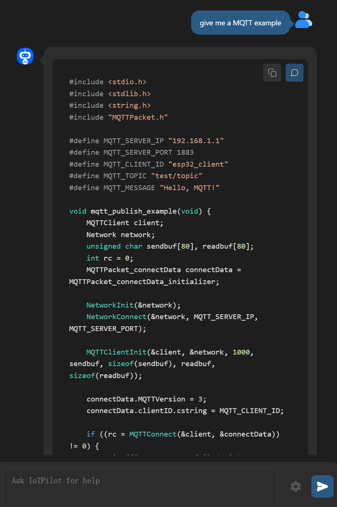
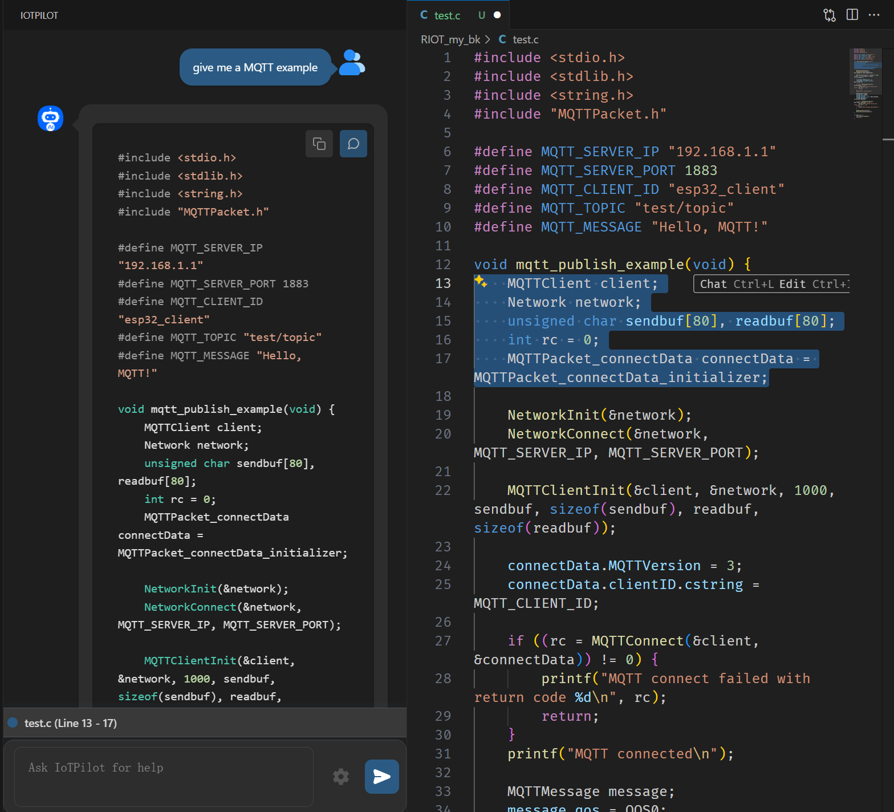

# IoTPilot

This is the VS Code extension tool corresponding to the paper "Programming Embedded IoT Applications in Natural Language with IoTPilot".

## Get Started

### Installation
IoTPilot is available as a VS Code extension. You can install it directly from the VS Code extension marketplace by searching for "IoTPilot" (recommended). 

For development purposes, you can clone this repository and run the extension locally:
1. Clone the repository
2. Navigate to the extension directory
3. Run `npm install` to install dependencies
4. Press F5 in VS Code to launch the extension in debug mode

For more details, refer to the [official VS Code extension documentation](https://code.visualstudio.com/api/get-started/your-first-extension) or check our [extension quickstart guide](vscode_extension/vsc-extension-quickstart.md).

### Usage

First, you need to click the gear button on the right side of the input box to configure settings, as shown in the image below. The username is only used to identify users and does not involve any authentication process - you can choose any name you prefer. For Model selection, only GPT-4o and Deepseek Coder are available. You need to fill in the corresponding API key and API URL. We provide Deepseek Coder's API by default so you can run a few tests. Additionally, you need to specify which OS and development board you want to develop on - we provide a few options. As for the Max Attempts, their functions are described in the paper. And the use content parameter determines whether to enable IoTPilot's workflow.

  <figure style="text-align: center; margin: 10px;">
    
    <figcaption>Figure 1: Settings Interface</figcaption>
  </figure>
  <figure style="text-align: center; margin: 10px;">
    
    <figcaption>Figure 2: Dialogue Interface</figcaption>
  </figure>

You can enter your IoT development requirements in the dialog box, and IoTPilot will generate code that meets your requirements as much as possible.
With the generated code, you can quickly start your IoT programming tasks. Although IoTPilot may not be completely accurate, it is designed to help users develop IoT applications faster. You can interact with IoTPilot in multiple iterations to improve the quality of the generated code, making it eventually usable.

  <figure style="text-align: center; margin: 10px;">
    
    <figcaption>Figure 3: Code Generation Example</figcaption>
  </figure>

After the server returns the IoTPilot's generated results, there will be two buttons in the upper right corner of each response, which can help you conveniently copy the code to the clipboard or directly overwrite the current file content with that code.
If most of the code is usable but has minor errors, you can select the relevant code lines and continue the conversation with IoTPilot. This selected content will be additionally included in the prompt to help IoTPilot with subsequent generation.

