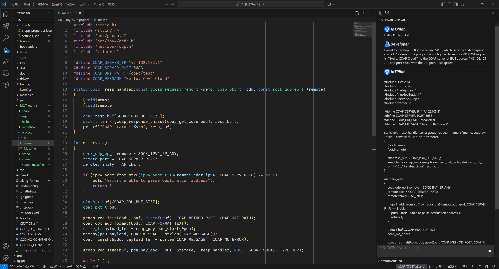

# IoTPilot

## Get Started

### Installation
This is a VS Code extension. You can follow the [official instructions](https://code.visualstudio.com/api/get-started/your-first-extension) and [vsc extension quickstart](./vsc-extension-quickstart.md) to run the extension locally in debugging mode.

### Usage

You can enter your IoT development requirements in the dialog box, and IoTPilot will generate code that meets your requirements as much as possible.
With the generated code, you can quickly start your IoT programming tasks. Although IoTPilot may not be completely accurate, it is designed to help users develop IoT applications faster. You can interact with IoTPilot in multiple iterations to improve the quality of the generated code, making it eventually usable.

##
The VS Code extension will soon be available on the marketplace.